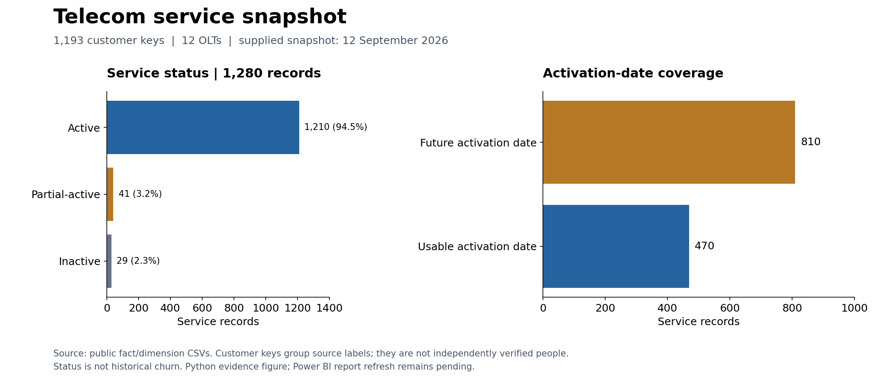

# Telecom OLT Service Analytics

Analyze service activity and plan exposure to prioritize ISP operational review.



*Reproducible Python figure; Power BI refresh remains pending.*

## Executive summary

The published snapshot contains **1,280 service records**, **1,193 customer keys**, and **12 OLTs**. It supports service-status monitoring and data-quality investigation. It does not measure historical churn or physical network utilization.

## Business questions

- Where are partial-active and inactive services concentrated?
- How does service status vary by plan and OLT?
- Which date records cannot support tenure analysis?
- Which OLT status rates warrant investigation?

## Verified findings

| Finding | Evidence | Operational action |
|---|---|---|
| Most services are active | 1,210 / 1,280 (94.53%) | Monitor status changes in later snapshots |
| 70 service records need status review | 41 partial-active, 29 inactive | Reconcile service status with support and billing records |
| Tenure has substantial missing coverage | 810 / 1,280 reported activation dates fall after the supplied snapshot date | Resolve source date semantics before cohort analysis |
| Service rows differ from customers | 1,280 records versus 1,193 normalized customer keys | Use service denominators for status shares and distinct keys for customer counts |

Recompute these values with `python scripts/analyze_public.py`; evidence is saved in [validated_metrics.json](docs/validated_metrics.json).

## Dataset and privacy

The supplied operational-style extract has been transformed into public surrogate-key tables. Independent provenance and customer identity matching remain unverified. Public datasets included in this repository have been sanitized to remove direct customer identifiers. This does not guarantee protection against external linkage.

Legacy screenshots, SQL exports and the unrelated sample workbook were removed from the current tree and preserved privately for review. Earlier Git history may retain them. A refreshed privacy-reviewed Power BI screenshot is still needed; no old image is presented as the current model.

## Tools and model

Python, pandas, NumPy, SQL and Power BI DAX. One service snapshot fact joins customer, OLT, plan, service-state and date dimensions using one-to-many, single-direction relationships. See [model and field definitions](data/powerbi_star_schema/relationships_and_model.md), [data dictionary](docs/data_dictionary.md), and [methodology](docs/methodology.md).

## KPI definitions

| KPI | Formula | Interpretation |
|---|---|---|
| Service records | Row count | Snapshot service observations |
| Customer keys | Distinct customer_key | Grouped source labels; not independently verified people |
| Active service share | Active rows / all service rows | Status composition |
| Inactive-only customer share | Customers with no active/partial service and at least one inactive service / customers in context | Snapshot inactivity, not churn |
| Listed fee exposure | Sum of listed fees on active/partial services | Not verified MRR or collections |
| Partial-active listed fees | Sum of fees on partial-active records | Potential exposure, not demonstrated loss |
| Service-state index | Mean of status weights 1 / 0.5 / 0 | Operational status proxy, not telemetry |

## Reproduce

```bash
python -m pip install -r requirements.txt
python -m unittest discover -s tests -v
python scripts/render_overview.py
python scripts/analyze_public.py
python anomaly_detection.py
```

Optional private-source rebuild: `python scripts/build_powerbi_star_schema.py --source customers.csv --as-of-date 2026-09-12`. Never commit the private source. Public analysis works without it.

For Power BI, import the six model CSVs and follow the relationship guide. The legacy filename [churn_kpi_measures.dax](data/powerbi_star_schema/churn_kpi_measures.dax) now contains status-based measure names. SQL Server DDL is in `sql/`; the SQLite evidence script is executable without a server.

## Limitations and next steps

Verify source authenticity, billing periods and customer grouping; repair activation dates; obtain cancellation events and interval network telemetry; then refresh a reviewed Power BI report. No causal, churn-prediction or revenue-impact claim is supported.

## Repository structure

- `data/powerbi_star_schema/`: public model tables and DAX
- `scripts/`: private-source ETL and public SQL evidence
- `sql/`: SQL Server schema
- `tests/`: relationship, privacy and date checks
- `docs/`: methodology, dictionary and verified metrics

Skills demonstrated: data cleaning, grain validation, dimensional modeling, SQL aggregation, DAX design and operational analysis.
