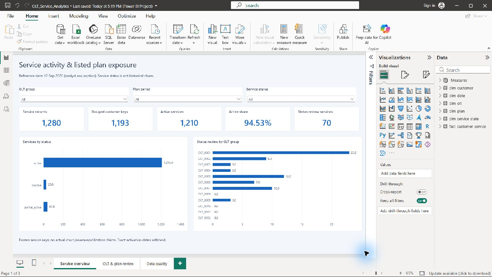

# Telecom OLT Service Analytics

A reproducible service-status and data-quality portfolio project using a sanitized snapshot, Python, MySQL and a validated Power BI report.



## Findings

- **1,280 service rows / 1,193 grouped customer keys**: use the correct grain for every denominator. Keys represent normalized source labels, not verified people.
- **1,210 active (94.53%), 41 partial-active and 29 inactive services**: prioritize 70 status-review records. Inactivity is not historical churn.
- **1,275 earlier prepared activation dates differed from the original**; 810 were beyond the assumed reference date, versus zero in the original. All 1,280 public dates and tenure values are now withheld. Historical flags remain visible; no cohort claims are made.

There are 12 source-address groups, not a verified physical OLT inventory. Monthly active/partial listed fee exposure is **2,956,272 undisclosed units** across monthly plans. Amounts are compared within their listed period; they are not recognized revenue or verified MRR. There are 58 unspecified plan periods and 22 inactive-only grouped customer keys.

## Implemented and tested

The editable [Power BI project](dashboard/OLT_Service_Project/OLT_Service_Analytics.pbip) contains Service overview, OLT & plan review, and Data quality pages. On **1 October 2026**, it was refreshed and saved in Desktop: **114/114 DAX checks passed**, covering 19 measures across six filter contexts. All three pages rendered; an OLT slicer and reset reconciled cards and charts. [Execution evidence and screenshots](docs/powerbi_validation.md).

Native **MySQL 8.0.46 passed seven KPI checks** against independent pandas totals. SQLite scripts are supplementary audits; the author's original SQL platform is MySQL. Python tests cover grain, keys, privacy, source reconciliation and date exclusions. [MySQL receipt](docs/mysql_validation.json).

## Reproduce from a clean clone

```bash
python -m pip install -r requirements.txt
python -m unittest discover -s tests -v
python scripts/analyze_public.py
python scripts/audit_public.py
python scripts/analyze_plan_periods.py
python scripts/build_dax_validation.py
python scripts/configure_powerbi.py
```

Open the PBIP, refresh, and execute `docs/validate_measures.dax` in DAX query view. Expect Checks=114, Passed=114 and empty Failures. [Detailed refresh guide](docs/powerbi_validation.md) and [native MySQL instructions](docs/sql_engine_notes.md).

The public clone needs no confidential workbook or portal connection. It reproduces the frozen analytical inputs, not the confidential original extraction. Exact dates, contacts and source OLT addresses must not be added to Git; local `.pbi` caches are ignored. Earlier repository history may retain legacy artifacts.

## Provenance and limits

The author supplied a confidential government-platform workbook privately and confirmed Activation Date means internet-service activation, and that listed amounts relate to the supplied plan periods. The original 1,320 rows contain 1,280 Combo-service rows; fee/plan/status/OLT/customer grouping corroborates their correspondence. The transformation that changed the earlier prepared dates is unknown. [Before/after source evidence](docs/source_workbook_review.md).

The reference date **2026-09-12 is an analyst assumption**, not a verified export date. A/D/E status mappings are analytical assumptions. Currency and portal definitions are undisclosed. No real churn, network utilization, causal impact or customer-retention improvement is established. Sequential keys cannot be joined to independently generated future extracts: [stable pseudonymous-key policy](docs/source_and_key_contract.md).

## Review and interview

[Portfolio review](docs/portfolio_review.md) provides changed-file groups, before/after evidence, an interview story and the scoped readiness assessment. [Dictionary](docs/data_dictionary.md), [model](data/powerbi_star_schema/relationships_and_model.md), [methodology](docs/methodology.md) and [date policy](docs/date_publication_policy.md) document definitions.
