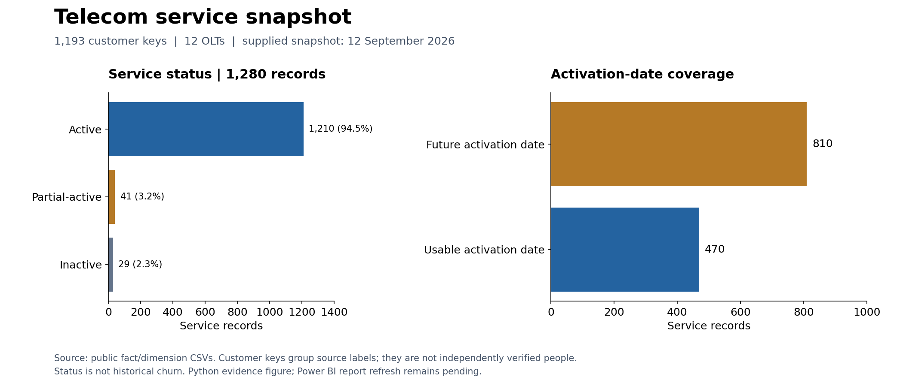

# Telecom OLT Service Analytics

Analyze service activity and plan exposure to prioritize ISP operational review.



*Reproducible Python figure; Power BI refresh remains pending.*

## Executive summary

The published snapshot contains **1,280 service records**, **1,193 customer keys**, and **12 grouped OLT-address keys**. Those address groups are not a verified physical device inventory. It supports service-status monitoring and data-quality investigation. It does not measure historical churn or physical network utilization.

## Business questions

- Where are partial-active and inactive services concentrated?
- How does service status vary by plan and OLT?
- Which date records cannot support tenure analysis?
- Which OLT status rates warrant investigation?

## Verified findings

| Finding | Evidence | Operational action |
|---|---|---|
| Most services are active | 1,210 / 1,280 (94.53%) | Monitor status changes in later snapshots |
| 70 service records need status review | 41 partial-active, 29 inactive | Reconcile service status with support and billing records |
| Public activation dates need reconciliation | 810 / 1,280 public activation dates fall after the configured cutoff; 1,275 differ from original source | Restore reviewed source dates and confirm the actual snapshot before cohort analysis |
| Service rows differ from customers | 1,280 records versus 1,193 normalized customer keys | Use service denominators for status shares and distinct keys for customer counts |

Recompute these values with `python scripts/analyze_public.py`; evidence is saved in [validated_metrics.json](docs/validated_metrics.json).

The independent [public audit receipt](docs/public_audit.json) adds KPI-denominator and quality checks: **810/1,280 (63.28%)** reported activations are future-dated, **816/1,280 (63.75%)** service rows require some quality review, and **58** rows have an unknown plan period. Of the 1,193 grouped customer keys, **22** are inactive-only under the documented snapshot rule. These are review leads, not evidence of churn. See the [quality review](docs/public_quality_review.md).

**Original-source correction:** the project author supplied the original workbook privately on 1 October 2026 and confirmed that Activation Date means internet-service activation. Its 1,280 Combo-service rows match the public fees/plans/status grouping, but **1,275 public dates differ**: the source has **zero** dates after the configured cutoff, versus **810** in the public model. These are public-data discrepancies, not established defects in the original dates. See the [source review](docs/source_workbook_review.md) and [aggregate receipt](docs/source_workbook_receipt.json). The public data and Power BI inputs have not yet been corrected.

## Dataset and privacy

The author identifies the supplied original workbook as a confidential government-platform customer export. It was transformed into public surrogate-key tables. Portal/billing documentation will not be requested or published; source-status mappings and the analysis reference date remain explicit assumptions. Public tables remove direct customer identifiers, but that does not guarantee protection against external linkage.

The current sequential customer keys are stable only within this frozen build. They must not be joined to independently generated snapshots. The [source and future-key contract](docs/source_and_key_contract.md) explains what evidence and privacy controls are needed before longitudinal analysis. The original workbook is available privately for reconciliation and intentionally excluded from Git; a fresh public clone can reproduce the public audit but not the original private-source ETL.

Legacy screenshots, SQL exports and the unrelated sample workbook were removed from the current tree and preserved privately for review. Earlier Git history may retain them. A refreshed privacy-reviewed Power BI screenshot is still needed; no old image is presented as the current model.

## Tools and model

Python, pandas, NumPy, MySQL (the author's project SQL engine) and Power BI DAX. One service snapshot fact joins customer, OLT, plan, service-state and date dimensions using one-to-many, single-direction relationships. See [model and field definitions](data/powerbi_star_schema/relationships_and_model.md), [data dictionary](docs/data_dictionary.md), and [methodology](docs/methodology.md).

## KPI definitions

| KPI | Formula | Interpretation |
|---|---|---|
| Service records | Row count | Snapshot service observations |
| Customer keys | Distinct customer_key | Grouped source labels; not independently verified people |
| Active service share | Active rows / all service rows | Status composition |
| Inactive-only customer share | Customers with no active/partial service and at least one inactive service / customers in context | Snapshot inactivity, not churn |
| Listed fee exposure | Sum of listed fees on active/partial services | Not verified MRR or collections |
| Partial-active listed fees | Sum of fees on partial-active records | Potential exposure, not demonstrated loss |
| Service-state index | Mean of status weights 1 / 0.5 / 0 | Operational status proxy, not telemetry |

The author confirms that listed plan amounts relate to the supplied plan periods. Report them **within each period**: 1,188 monthly plans, six annual plans, other stated periods and 58 unspecified rows. Run `python scripts/analyze_plan_periods.py` for independently reconciled counts and amounts; see the [period review](docs/plan_period_review.md) and [receipt](docs/plan_period_receipt.json). Currency is undisclosed. The legacy `monthly_fee` field is a source amount and must not become an MRR headline for mixed periods.

## Reproduce

```bash
python -m pip install -r requirements.txt
python -m unittest discover -s tests -v
python scripts/render_overview.py
python scripts/analyze_public.py
python scripts/audit_public.py
python scripts/analyze_plan_periods.py
python anomaly_detection.py
```

Optional private-source rebuild: `python scripts/build_powerbi_star_schema.py --source customers.csv --as-of-date 2026-09-12`. Never commit the private source. Public analysis works without it.

For Power BI, import the six model CSVs and follow the relationship guide. The legacy filename [churn_kpi_measures.dax](data/powerbi_star_schema/churn_kpi_measures.dax) now contains status-based measure names. The existing `sql/` DDL is a SQL Server reference artifact, not an executable MySQL script. SQLite was used only for additional independent audit checks; native MySQL execution has not been verified in this review. See [SQL engine notes](docs/sql_engine_notes.md).

**Power BI status:** the committed files are import-ready data, model guidance and candidate DAX. A privacy-reviewed current Desktop report, DAX execution/reconciliation and tested slicer behavior remain pending. The Python/SQLite audit does not claim to validate Power BI execution.

## Limitations and next steps

Reconcile public activation dates with the original workbook, retain disclosed assumptions where portal definitions/reference dates are confidential, report listed amounts by their periods, and refresh a reviewed Power BI report. Cancellation events or interval telemetry would be needed only for stronger churn/network claims. No measured business impact is established.

## Repository structure

- `data/powerbi_star_schema/`: public model tables and DAX
- `scripts/`: private-source ETL and public SQL evidence
- `sql/`: SQL Server schema
- `tests/`: relationship, privacy and date checks
- `docs/`: methodology, dictionary and verified metrics

Skills demonstrated: data cleaning, grain validation, dimensional modeling, SQL aggregation, DAX design and operational analysis.
